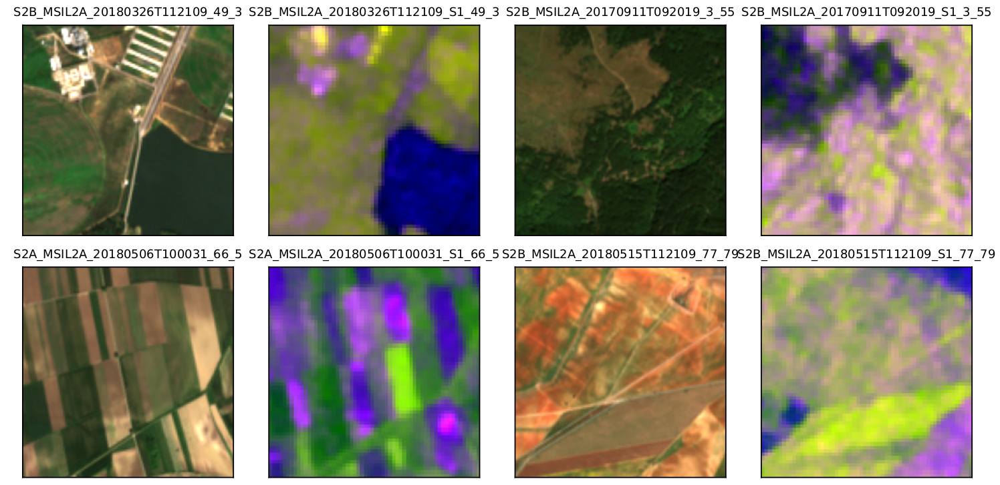

# Creation of BigEarthNet-Sen1

---

This repository contains the data processing codes for Sentinel-1 VVVH image creation of BigEarthNet dataset. For the details about **BigEarthNet**, please kindly refer to [this website](http://bigearth.net/). We note the original BigEarthNet dataset as BigEarthNet-Sen2 hereafter. 

## Requirements

* [SNAP Toolbox](http://step.esa.int/main/download/snap-download/)

* [Sen1mosaic python toolbox](https://readthedocs.org/projects/sen1mosaic/downloads/pdf/latest/)
  
## Pipeline

### Retrieve the Sentinel-1 tiles for downloading

Retrieve the geo-locations of the Sentinel-2 tiles which are utilized for the creation of BigEarthNet-Sen2. These Sentinel-2 tiles can be obtained through [this link](https://gitlab.tubit.tu-berlin.de/rsim/bigearthnet-tools).

* Getting the associated footprints of Sentinel-2 tiles from the meta data.
* Retrieve the corresponding Sentinel-1 tiles based on the footprints.
* For each Sentinel-2 tile, there may be several Sentinel-1 tiles covering it. In order to significantly reduce the number of Sentinel-1 tiles to be downloaded, [relative orbit](https://sentinel.esa.int/web/sentinel/missions/sentinel-1/satellite-description/orbit) of each tile should be retrieved. For each relative orbit, we just keep one Sentinel-1 tile, to avoid the duplicated Sentinel-1 tiles for downloading.
* Also, we should make sure that the union of the footprints of the Sentinel-1 tiles should cover the assocaited Sentinel-2 tile.
* Finally, we can get the product information of the Sentinel-1 tiles to be downloaded.

After this step, we get a npy file `BigEarthNetTileInfo_v2.npy` which contains the basic information of Sentinel-2 tiles utilized in BigEarthNet-Sen2. Also, we have `BigEarthNetSen2UUID2Sen1ProdName.npy`, which links the Sentinel-2 tiles with respect to the assocaited Sentinel-1 tiles to be downloaded. We construct the npy file as a nested dictionary. 

Loading `BigEarthNetSen2UUID2Sen1ProdName.npy` via:

```
sen1_tile_download_info_pth = './BigEarthNetSen2UUID2Sen1ProdName.npy'
data = np.load(sen1_tile_download_info_pth, allow_pickle=True).item()
Sen2UUID_2_Sen1ProdNames = data['Sen2UUID_2_Sen1ProdName']
```

Loading `BigEarthNetTileInfo_v2.npy` via:
```
sen2_tile_info_pth = './BigEarthNetTileInfo_v2.npy'
data = np.load(sen2_tile_info_pth, allow_pickle=True).item()
tile_info = data['tile_info']
```
The keys of `tile_info` are the tiling grids of the Sentinel-2 tiles of BigEarthNet-Sen2. Within each tiling grid, the keys represent the UUID of the Sentinel-2 tiles. Then, we retrieve the Sentinel-1 tiles accordingly.
```
for tile_grid in list(tile_info.keys()):
    for uuid in list(tile_info[tile_grid].keys()):
        sen1_tiles = Sen2UUID_2_Sen1ProdNames[uuid]
```
Then, we can download the assocaited Sentinel-1 tiles.

### Downloading Sentinel-1 tiles

We download the corresponding tiles via `./sen1mosaic_scripts/down_sen1_tiles.py`

### Preprocessing the downloaded Sentinel-1 tiles

Preprocess the downloaded Sentinel-1 tiles based on the following steps:

- GRD border noise removal

- Thermal noise removal

- Radiometric calibration

- Speckle noise filtering

- Terrain correction

- Transform into decibels (dB)

The associated scripts can be found in: `./sen1mosaic_scripts/proc_sen1_tiles.py`

Please note that in the step of **Terrain correction**, for some tiles with high latitude, ASTER DEM is needed, SRTM is out of the coverage. Therefore, the corresponding xml file should be modified. For reference, refer to [Sentinel-1 preprocessing on Google Earth Engine](https://developers.google.com/earth-engine/sentinel1).

### Mosaicing the processed SAR images

The script of this step is `./sen1mosaic_scripts/mosaic_sen1_tiles.py`


### Clipping the SAR images

Clip the mosaic SAR images with respect to the associated Sentinel-2 tiles via `./sen1mosaic_scripts/clip_patches_sen1_tiles.py`

At last, we can obtain the BigEarthNet-Sen1 dataset based on [the names of BigEarthNet-Sen2](https://gitlab.tubit.tu-berlin.de/rsim/bigearthnet-tools/blob/master/files/tile_names_and_links.csv).

## Visualization

Left is the Sentinel-2 image, Right is the RGB visualization of Sentinel-1 VVVH bands



## Acknowledgement

Some discussions are done in this work, hereby, I would like to thank:

* [Gencer Sümbül](https://www.rsim.tu-berlin.de/menue/team/gencer_suembuel/)
* [Gerald Baier](https://www.geoinformatics2018.com/member/geraldbaier/)
* [Samuel Bowers](https://www.research.ed.ac.uk/portal/en/persons/sam-bowers(75f5449d-1306-430e-99a1-c474eadeda50).html)
* [Jingliang Hu](https://www.sipeo.bgu.tum.de/team/20-people/77-jingliang-hu)
